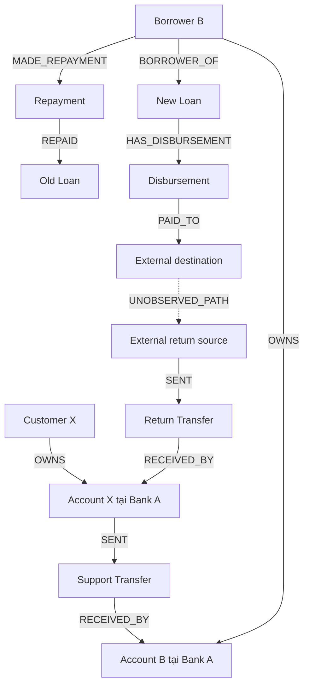

# Demo Neo4j phát hiện khách hàng cung cấp thanh khoản phục vụ đảo nợ

## 1. Kết quả của bộ demo

Bộ mã này chạy trên Neo4j 5.x Community hoặc Enterprise, không cần APOC và
không cần Graph Data Science.

Query phát hiện bắt đầu từ toàn bộ sự kiện thu nợ trong tháng 06/2026, sau đó
truy ngược nguồn tiền, kiểm tra số dư, tìm giải ngân và tổng hợp tiền quay lại.
Query không nhận mã X làm đầu vào, không dùng nội dung giao dịch, không dùng
quan hệ CIF và không dùng quan hệ `UNOBSERVED_PATH`.

Kết quả mong đợi:

| Khách hàng | Kết quả | Diễn giải |
| --- | ---: | --- |
| X001 | Mức 4 | 4 chuỗi hoàn chỉnh với 4 khách hàng B; 86 điểm |
| X002 | Không cảnh báo | B008–B010 đã đủ số dư trước khi nhận tiền |
| X003 | Mức 3 | 1 chuỗi hoàn chỉnh với B005 |
| X004 | Mức 1 | Có nguồn tiền trước thu nợ nhưng không giải ngân lại |
| X005 | Mức 2 | Có giải ngân lại nhưng tiền vào X005 chỉ đạt 4,29% |

## 2. Danh sách tệp

| Tệp | Mục đích |
| --- | --- |
| `00_cleanup.cypher` | Xóa riêng dữ liệu demo theo `pocDataset` |
| `01_schema.cypher` | Constraint và index cho Neo4j 5.x |
| `02_demo_data.cypher` | Dữ liệu nghiệp vụ gốc X001–X005 và B001–B010 |
| `03_detect_and_materialize.cypher` | Tự phát hiện, tạo `DRDetectedChain`, `DRAlert` và chấm điểm |
| `04_demo_queries.cypher` | 11 truy vấn bảng, graph, timeline và đối chứng |
| `05_browser_style.grass` | Màu, caption và độ rộng cạnh cho Neo4j Browser |
| `06_acceptance_tests.cypher` | 9 kiểm tra nghiệm thu; mọi dòng phải `passed=true` |
| `07_readonly_level4_detection.cypher` | Query thuần đọc, tự tìm X Mức 4 trực tiếp từ dữ liệu gốc |
| `data_dictionary.csv` | Từ điển node, relationship và phạm vi quan sát |
| `expected_results.csv` | Kết quả đối chiếu X001–X005 |

## 3. Thứ tự chạy

### Phương án A — cypher-shell

Đứng trong thư mục chứa bộ tệp và chạy lần lượt:

```bash
cypher-shell -a bolt://localhost:7687 -u neo4j -d neo4j -f 01_schema.cypher
cypher-shell -a bolt://localhost:7687 -u neo4j -d neo4j -f 02_demo_data.cypher
cypher-shell -a bolt://localhost:7687 -u neo4j -d neo4j -f 03_detect_and_materialize.cypher
cypher-shell -a bolt://localhost:7687 -u neo4j -d neo4j -f 06_acceptance_tests.cypher
```

Không đưa mật khẩu vào câu lệnh; `cypher-shell` sẽ yêu cầu nhập. Nếu database
không có tên `neo4j`, thay giá trị sau `-d`.

Trên Windows, dùng `cypher-shell.bat` với các tham số tương tự.

### Phương án B — Neo4j Browser

1. Mở từng tệp theo thứ tự `01` → `02` → `03`.
2. Sao chép và chạy từng statement kết thúc bằng dấu chấm phẩy.
3. Chạy `06_acceptance_tests.cypher`; tất cả 9 dòng phải có `passed=true`.
4. Mở `04_demo_queries.cypher` và chạy từng khối Q01–Q11.

Muốn nạp lại từ đầu, chạy `00_cleanup.cypher`, sau đó chạy lại `02` và `03`.
Constraint/index có thể giữ nguyên.

## 4. Mô hình graph



Ba lớp dữ liệu được tách rõ:

- Dữ liệu gốc Bank A quan sát: `DRTransfer`, `DRRepayment`,
  `DRDisbursement`, `DRBalanceSnapshot`.
- Kết quả dẫn xuất: `DRDetectedChain`, `DRAlert`.
- Vùng ngoài Bank A: `UNOBSERVED_PATH`, luôn có
  `observedByBankA=false` và `confidence='HYPOTHESIS_ONLY'`.

## 5. Logic của query phát hiện

`03_detect_and_materialize.cypher` thực hiện theo trình tự:

1. Lấy mọi `DRRepayment` hợp lệ có thời điểm trong tháng 06/2026.
2. Truy ngược mọi `DRTransfer` trực tiếp vào tài khoản của B trong 72 giờ.
3. Nhóm theo bộ `(X, B, repayment)` để nhiều giao dịch của cùng X được cộng.
4. Kiểm tra tổng tiền ≥100 triệu và ≥30% tiền thu nợ.
5. Chọn snapshot gần nhất nhưng không sau giao dịch hỗ trợ đầu tiên.
6. Kiểm tra B có thiếu hụt và tiền X bù ít nhất 50% thiếu hụt.
7. Chọn giải ngân đạt ≥50% tiền thu nợ, trong bảy ngày sau thu nợ.
8. Tổng hợp mọi tiền vào tài khoản X trong bảy ngày sau giải ngân.
9. Xác định Mức 3 khi tỷ lệ quay lại nằm trong khoảng 50%–150%.
10. Tổng hợp theo X; Mức 4 cần ≥3 chuỗi và ≥3 B khác nhau.
11. Tính bảy cấu phần điểm, tổng tối đa 100.

`07_readonly_level4_detection.cypher` thực hiện cùng logic nhưng chỉ trả bảng
Mức 4, không tạo node dẫn xuất.

## 6. Bốn chuỗi X001

Đơn vị số tiền trong bảng là triệu VND.

| B | Tiền X cấp | Thu nợ | Số dư trước | Thiếu hụt | Bù thiếu hụt | Đến thu nợ | Giải ngân | Đến giải ngân | Tiền về X | Tỷ lệ về |
| --- | ---: | ---: | ---: | ---: | ---: | ---: | ---: | ---: | ---: | ---: |
| B001 | 800 | 900 | 100 | 800 | 100,00% | 5 giờ | 1.000 | 1 ngày | 820 | 102,50% |
| B002 | 1.200 | 1.400 | 250 | 1.150 | 104,35% | 20 giờ | 1.500 | 2 ngày | 1.100 | 91,67% |
| B003 | 600 | 1.000 | 300 | 700 | 85,71% | 48 giờ | 900 | 3 ngày | 450 | 75,00% |
| B004 | 2.000 | 2.300 | 400 | 1.900 | 105,26% | 10 giờ | 2.500 | 1 ngày | 2.100 | 105,00% |

Tổng X001 đã chuyển là 4,60 tỷ VND; tổng tiền vào sau giải ngân là 4,47 tỷ
VND; tỷ lệ tổng thể là 97,17%.

Điểm X001:

| Cấu phần | Điểm |
| --- | ---: |
| 4 khách hàng vay khác nhau | 20 |
| 4 chuỗi hoàn chỉnh | 16 |
| Trung bình 20,75 giờ đến thu nợ | 12 |
| Tỷ lệ hỗ trợ trung bình 80,39% | 10 |
| Trung bình 42 giờ đến giải ngân | 8 |
| Tỷ lệ quay lại trung bình 93,54% | 15 |
| Có cả B cá nhân và doanh nghiệp | 5 |
| **Tổng** | **86** |

## 7. Kịch bản trình diễn đề xuất

1. Chạy Q01 để xuất danh sách X Mức 4: chỉ có X001.
2. Chạy Q03 để giải thích 86 điểm.
3. Chạy Q06 để xem X001 ở trung tâm và bốn B xung quanh.
4. Chạy Q05 để mở toàn bộ bằng chứng giao dịch.
5. Chạy Q07 với B002 để thấy ba giao dịch hỗ trợ và hai giao dịch quay lại.
6. Chạy Q08 để xem timeline đúng thứ tự.
7. Chạy Q02 và Q09 để chứng minh các đối chứng không bị gom nhầm.
8. Chạy Q11 để xác nhận vùng ngoài Bank A không bị mô tả như giao dịch quan sát.

## 8. Kiểu hiển thị trong Neo4j Browser

Trong Browser:

1. Chạy `:style`.
2. Chọn Upload và nạp `05_browser_style.grass`.
3. Chạy Q05, Q06 hoặc Q07 rồi chọn tab Graph.

Neo4j Browser hiện cho phép cấu hình màu, độ rộng và caption theo loại
relationship, nhưng không cung cấp thuộc tính nét đứt trong GraSS. Vì vậy
`UNOBSERVED_PATH` được thể hiện bằng cạnh xám mảnh và caption
`- - không quan sát được - -`. Quan hệ này vẫn tách hẳn về type và metadata,
không thể bị hiểu nhầm là giao dịch thật.

Tài liệu Neo4j Browser:
<https://neo4j.com/docs/browser/operations/browser-styling/>

## 9. Lưu ý khi chuyển từ demo sang dữ liệu thật

- Thay mốc thời gian cố định bằng `$monthStart` và `$nextMonthStart`.
- Dữ liệu đầu vào cần bao phủ ít nhất 72 giờ trước tháng và bảy ngày sau tháng.
- Snapshot phải phản ánh số dư khả dụng ngay trước cụm tiền hỗ trợ đầu tiên.
- Cần quy tắc phân bổ khi nhiều cửa sổ giải ngân của cùng X chồng lấn.
- Với hàng trăm triệu giao dịch, nên lọc/partition sự kiện thu nợ theo tháng
  trước, duy trì index thời gian và materialize kết quả theo kỳ.
- Có thể thêm blacklist/whitelist nghiệp vụ ở bước sau, nhưng không nên làm
  thay đổi bằng chứng chuỗi gốc.
- Mức 4 là cảnh báo điều tra, không phải kết luận vi phạm.

Kết luận phù hợp của demo:

> X001 có dấu hiệu lặp lại việc cung cấp nguồn tiền giá trị lớn cho nhiều khách
> hàng vay ngay trước thời điểm thu nợ. Sau khi các khách hàng này hoàn thành
> nghĩa vụ và được giải ngân lại, X001 nhận về lượng tiền có giá trị tương đồng
> trong thời gian ngắn. Mẫu hành vi cần được kiểm tra về bản chất kinh tế,
> nguồn tiền và mục đích giao dịch.

